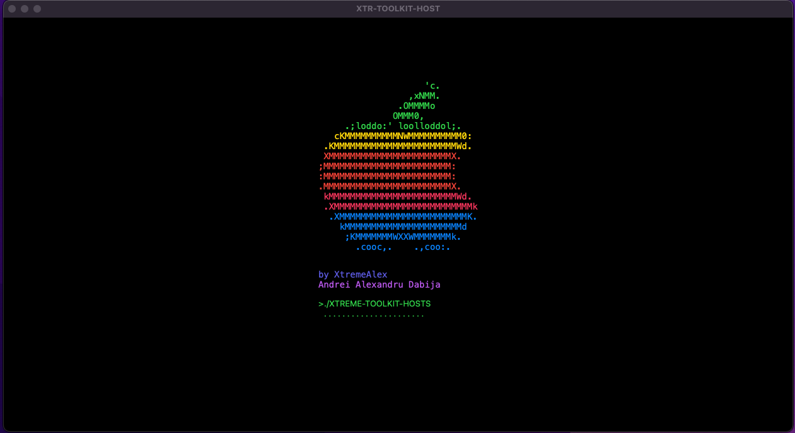
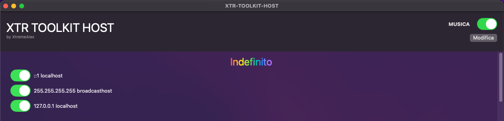
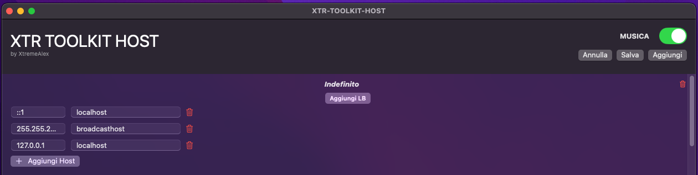

# Xtr Toolkit Hosts MacOs






**XTR Toolkit Hosts** è un'applicazione macOS ispirata alla gemella https://github.com/XtremeAlex/xtr-toolkit-hosts sviluppata in JAVA, progettata per gestire il file `/etc/hosts` del sistema in modo semplice ed efficace. Permette agli utenti di visualizzare, aggiungere, modificare ed eliminare gruppi di host, gestire i load balancer associati e interagire con un'interfaccia utente intuitiva arricchita da animazioni. E' ancora in ALPHA ed è sotto TEST, vi aggiornerò con le future release.
    
---

## Indice

- [Panoramica Generale](#panoramica-generale)
- [Caratteristiche](#caratteristiche)
- [Architettura dell’Applicazione](#architettura-dellapplicazione)
  - [Modelli (Models)](#modelli-models)
  - [Viste (Views)](#viste-views)
  - [Controller e Presenter](#controller-e-presenter)
  - [Utilità](#utilità)
- [Flusso Logico dell’Applicazione](#flusso-logico-dellapplicazione)
  - [Avvio e Animazione](#avvio-e-animazione)
  - [Inizializzazione dei Dati](#inizializzazione-dei-dati)
  - [Interazione dell’Utente](#interazione-dellutente)
  - [Gestione della Musica](#gestione-della-musica)
- [Installazione](#installazione)
- [Utilizzo](#utilizzo)
- [Contribuire](#contribuire)
- [Licenza](#licenza)
- [Ringraziamenti](#ringraziamenti)

---

## Panoramica Generale

**XTR Toolkit Hosts** è un'applicazione macOS che facilita la gestione del file `/etc/hosts` del sistema. Le principali funzionalità includono:

- **Visualizzazione, Aggiunta, Modifica ed Eliminazione** di gruppi di hosts.
- **Gestione degli Host** associati a ciascuna applicazione.
- **Abilitazione o Disabilitazione** degli host in modo semplice tramite toggle.
- **Gestione dei Load Balancer** per le applicazioni (per chi usa K8s + ALB è molto utile).
- **Interfaccia Utente Intuitiva** con animazioni per un'esperienza utente migliorata.

---

## Caratteristiche

- **Gestione Completa degli Host:** Visualizza, aggiungi, modifica ed elimina host e gruppi di host.
- **Load Balancer:** Configura e gestisci load balancer per distribuire il traffico tra diversi host.
- **Interfaccia Utente Dinamica:** Animazioni, transizioni fluide.
- **Modalità di Visualizzazione e Modifica:** Passa facilmente tra modalità di sola lettura e modifica.
- **Persistenza Automatizzata:** Le modifiche vengono salvate automaticamente nel file `/etc/hosts`.

---

## Architettura dell’Applicazione

L'applicazione segue un'architettura **MVVM (Model-View-ViewModel)** con elementi di **MVP (Model-View-Presenter)**, garantendo una separazione netta delle responsabilità e una maggiore facilità di manutenzione.

### Modelli (Models)

- **Host:**
  - **Proprietà:**
    - `ip`: Indirizzo IP dell’host.
    - `fqdn`: Nome di dominio completo.
    - `enabled`: Stato dell’host (abilitato/disabilitato).
  - **Ruolo:** Rappresenta un singolo record nel file `/etc/hosts`. È osservabile per aggiornare l’interfaccia quando cambia.

- **HostApp:**
  - **Proprietà:**
    - `name`: Nome dell’applicazione.
    - `info`: Informazioni aggiuntive sull’app.
    - `lb`: Indirizzo del load balancer associato.
    - `hosts`: Lista degli host associati all’app.
  - **Ruolo:** Raggruppa gli host sotto un’applicazione specifica e gestisce i load balancer per l’aggiornamento degli IP.

### Viste (Views)

- **ContentView:** Vista principale che contiene l’animazione introduttiva.
- **IntroAnimationView:** Gestisce l’animazione iniziale con ASCII art e simulazione di un terminale, ho preso in esempio il mio.
- **MainView:** Vista principale dell’applicazione dopo l’animazione, mostra EditingView o ViewingView in base allo stato.
- **EditingView e ViewingView:** Gestiscono rispettivamente le modalità di modifica e visualizzazione.
- **HeaderView:** Contiene l’intestazione con controlli per la musica e la modalità di modifica.
- **Altre Viste Personalizzate:** Include righe e modali specifiche per l’interfaccia utente.

### Controller e Presenter

- **MainViewController:**
  - **Proprietà:**
    - `apps`: Lista delle applicazioni (`HostApp`).
    - `isEditing`: Stato della modalità di modifica.
    - `isMusicOn`: Controlla la riproduzione della musica.
  - **Metodi Principali:**
    - `saveChanges()`: Salva le modifiche al file hosts.
    - `showAddLBModal(for:)`: Mostra la modale per aggiungere un load balancer.
    - `updateIPForHost(_:lb:)`: Aggiorna l’IP di un host tramite il load balancer.
  - **Che Serve?:** Funziona come ViewModel, gestendo lo stato dell’applicazione e l’interazione con la vista.

- **MainPresenter:**
  - **Proprietà:**
    - `apps`: Modello dei dati attuale.
    - `originalApps`: Copia del modello originale per annullare le modifiche.
  - **Metodi Principali:**
    - `initialize()`: Inizializza l’applicazione leggendo il file hosts.
    - `saveChanges()`: Genera e scrive il nuovo contenuto del file hosts.
    - `addApp(_:)`, `removeApp(_:)`, `addHost(_:to:)`, `removeHost(_:)`: Gestione delle applicazioni e degli host.
  - **Che Serve?:** Gestisce la logica di business e interagisce con `IOHostParser`.

### Utilità

- **AudioManager:**
  - **Proprietà:**
    - `player`: Gestisce la riproduzione dell’audio.
  - **Metodi Principali:**
    - `playBackgroundMusic()`: Avvia o riprende la musica.
    - `pauseBackgroundMusic()`: Mette in pausa la musica.
  - **Che Serve?:** Gestisce la riproduzione della musica in modo centralizzato.

- **IOHostParser:**
  - **Metodi Principali:**
    - `parseHostsFile(filePath:)`: Legge e analizza il file `/etc/hosts`.
    - `writeHostsFileWithPrivileges(content:)`: Scrive il file hosts con privilegi elevati.
    - `generateOrderedCustomSection(_:)`: Genera la sezione personalizzata del file hosts.
  - **Che Serve?:** Gestisce tutta la logica di I/O per il file hosts, inclusa la gestione dei permessi.

---

## Flusso Logico dell’Applicazione

### Avvio e Animazione

1. **Avvio dell’Applicazione:**
   - Il punto di ingresso (`xtr_toolkit_hosts_macosApp`) utilizza l’annotazione `@main` per avviare `ContentView`.

2. **Animazione Introduttiva:**
   - `ContentView` contiene `IntroAnimationView`, che mostra un’animazione con ASCII art e una simulazione di terminale.
   - Avvia la musica di sottofondo tramite `AudioManager`.
   - Al termine dell’animazione, passa a `MainView` impostando `showMainContent` a `true`.

### Inizializzazione dei Dati

1. **Inizializzazione del MainViewController:**
   - Crea un’istanza di `MainPresenter` e chiama `presenter.initialize()` per leggere il file hosts.

2. **Parsing del File Hosts:**
   - `IOHostParser.parseHostsFile` legge il file e crea il modello dei dati (`apps` e `hosts`), gestendo commenti e sezioni personalizzate.

3. **Aggiornamento dell’Interfaccia:**
   - `MainViewController` aggiorna la vista con i dati ottenuti.

### Interazione dell’Utente

1. **Visualizzazione degli Host:**
   - In `ViewingView`, l’utente può abilitare o disabilitare gli host tramite toggle.
   - Ogni modifica viene salvata automaticamente nel file hosts.

2. **Modalità di Modifica:**
   - L’utente può passare a `EditingView` cliccando su “Modifica” in `HeaderView`.
   - Può aggiungere, modificare o eliminare applicazioni e host utilizzando viste modali per input dettagliati.

3. **Salvataggio delle Modifiche:**
   - Cliccando su “Salva” in `HeaderView`, i cambiamenti vengono salvati tramite `MainPresenter.saveChanges()`, che scrive il nuovo contenuto nel file hosts utilizzando `IOHostParser.writeHostsFileWithPrivileges`.

### Gestione della Musica

- Il controllo della musica avviene tramite il toggle in `HeaderView`.
- `MainViewController` osserva `isMusicOn` e chiama i metodi appropriati di `AudioManager` per avviare, mettere in pausa o riprendere la musica.

---

### Flusso di esecuzione
```
[App @main Entry Point]
    |
    v
[ContentView] --> [IntroAnimationView] --(animazione completata)--> [MainView]
                                                    |
                                                    v
                                           [MainViewController] <--Comunicazione bidirezionale--> [MainPresenter]
                                                    |                          |
                                                    v                          v
                                                [Views]                 [IOHostParser]
                                                    |
                                                    v
                                             [User Interactions]
```

## Installazione

1. **Clona il Repository:**

    ```bash
    git clone https://github.com/XtremeAlex/xtr-toolkit-hosts-macos.git
    ```
2. **Apri il Progetto in Xcode:**
    ```
    cd xtr-toolkit-hosts
    open XtremeAlex\xtr-toolkit-hosts-macos\xtr-toolkit-hosts-macos.xcodeproj
    ```
3. **Builda e Esegui l’Applicazione**
  - Seleziona il target desiderato e clicca su `Run` in Xcode.

## Utilizzo
 - Ricordarsi di aggiungere prima di usare l'app la seguente stringa nel file host: `##start-xtr-toolkit-host`, sta ad indicare il punto da cui iniziare a leggere

## Contribuire
    ```
    git checkout -b feature/nome-feature
    git commit -m "Aggiungi descrizione della feature"
    git push origin feature/nome-feature
    ```
## Licenza

Questo progetto è concesso in licenza secondo i termini della Licenza Proprietaria.


## Ringraziamenti
    - Community: Per il supporto per me che sono un neofita con swift... 
