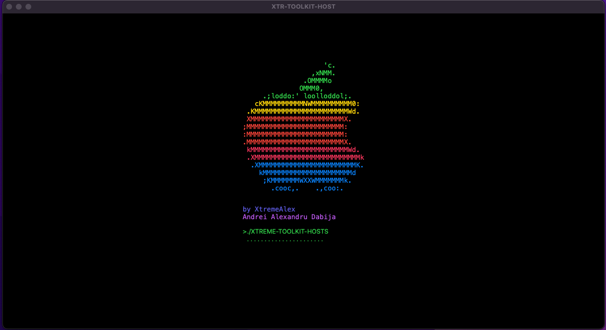
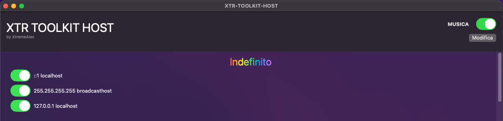
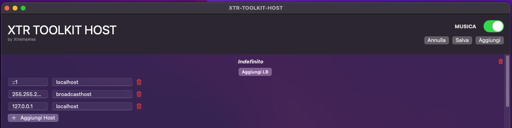

# xtr-toolkit-hosts-macos

Applicazione macOS nativa per gestire il file `/etc/hosts` di sistema, con gestione dei gruppi di host e dei load balancer.





> Stato: alpha, in sviluppo attivo.

## Info sul progetto

XTR Toolkit Hosts gestisce il file `/etc/hosts` del Mac al posto tuo: raggruppa gli host per applicazione, li accende e spegne con un interruttore, tiene aggiornati gli IP dietro ai load balancer e salva le modifiche in modo sicuro, con backup e audit.

È la versione nativa macOS di [xtr-toolkit-hosts](https://github.com/XtremeAlex/xtr-toolkit-hosts), l'app JavaFX multipiattaforma da cui è nata, e oggi è la più completa delle due. È ancora in ALPHA e sotto test: seguiranno aggiornamenti nelle prossime release.

Funzionalità principali:

- Visualizzazione, aggiunta, modifica ed eliminazione di gruppi di host.
- Gestione degli host associati a ciascuna applicazione.
- Abilitazione/disabilitazione degli host tramite toggle.
- Gestione dei load balancer per le applicazioni (utile con K8s + ALB).
- Interfaccia con animazioni.
- Persistenza automatica: le modifiche vengono salvate nel file `/etc/hosts`.
- Tema "2AD" condiviso con xtr-aeroport-edifact-spring-web e xtr-openmail-macos: scuro di
  default, chiaro o di sistema (menu **Aspetto** o Impostazioni ⌘,), accento rosso,
  etichette mono, pulsante Salva con effetto "lampada" durante la scrittura.
- Ricerca per app, IP o nome host; aggiornamento dell'IP dal load balancer tramite DNS reale.

### Uso aziendale

- **Il resto del file non si tocca**: tutto ciò che precede `##start-xtr-toolkit-host`
  (localhost, broadcasthost, voci gestite da MDM) resta identico; viene sostituita solo la
  sezione dell'app. Se il marcatore manca, la sezione viene aggiunta in coda.
- **Scrittura sicura**: lo script privilegiato verifica prima lo SHA-256 del file letto (se un
  agente MDM o un altro amministratore l'ha cambiato nel frattempo si ferma senza scrivere),
  crea un backup datato `/etc/hosts.xtr-toolkit.AAAAMMGG-hhmmss.bak` (ne conserva gli ultimi 5,
  configurabile), installa con `install -S` (copia atomica, `root:wheel 0644`), confronta il
  risultato byte per byte e svuota la cache DNS. Il file temporaneo ha nome univoco e permessi `0600`.
- **Ripristino da backup** (Impostazioni ⌘, → Backup): elenco dei backup datati con anteprima
  (`+n −m` righe rispetto al file attuale) e ripristino della sola sezione dell'app; le righe
  prima del marcatore restano quelle attuali. Passa dallo stesso percorso sicuro del
  salvataggio (password, hash, nuovo backup, verifica) quindi è a sua volta annullabile;
  bloccato con `ReadOnly` o con modifiche non salvate. Nell'audit: `"action":"restore"` e
  `restoredFrom`.
- **Audit**: ogni salvataggio aggiunge una riga JSON a `~/Library/Logs/xtr-toolkit-hosts/audit.log`
  (utente, data, backup, SHA-256 prima/dopo, righe aggiunte e rimosse) e al log di sistema
  (categoria `audit`).
- **Politica via MDM** (dominio `com.xtremealex.toolkit.hosts.xtr-toolkit-hosts-macos`, esempio in
  `packaging/hosts.mobileconfig.example`): `ReadOnly` (sola lettura), `BackupRetention` (1…50),
  `FlushDNS`, `theme` (tema imposto, selettori disattivati), `musicOn`, `showIntro`.
- **Interruttori coerenti con il file**: se un salvataggio immediato viene annullato o fallisce,
  lo stato mostrato torna quello di `/etc/hosts`.
- **Parser tollerante**: separatori multipli, tabulazioni, commenti in coda (`# nota`) e `# LB:` /
  `# APP:` con spazio vengono letti correttamente (prima generavano host vuoti che bloccavano
  il salvataggio).
- **Validazione**: IP (IPv4/IPv6, anche con zona) e nomi host RFC 1123 sono verificati nei
  moduli; con voci non valide il salvataggio viene bloccato con l'elenco, senza scrivere nulla.
- **Ordine stabile** delle righe fra un salvataggio e l'altro (diff leggibili).
- **Silenzioso di default**: musica spenta e ricordata (`musicOn`), animazione iniziale
  disattivabile (`showIntro`) e saltabile con clic/Invio/Esc, assente con "Riduci movimento".
  Le chiavi sono in `UserDefaults` e si possono distribuire via profilo MDM.
- **Diagnostica**: log unificato, sottosistema `com.xtremealex.toolkit.hosts`.
- **Nessuna dipendenza esterna**: rimosso il pacchetto SwiftUIX (non usato); Hardened Runtime attivo.

## Stack tecnologico

- Swift, SwiftUI (macOS)
- Xcode
- Architettura MVVM con elementi di MVP

## Architettura dell'applicazione

L'applicazione segue un'architettura MVVM (Model-View-ViewModel) con elementi di MVP (Model-View-Presenter), garantendo separazione delle responsabilità e facilità di manutenzione.

### Modelli (Models)

- **Host**: proprietà `ip`, `fqdn`, `enabled`. Rappresenta un singolo record del file `/etc/hosts`; è osservabile per aggiornare l'interfaccia al cambiamento.
- **HostApp**: proprietà `name`, `info`, `lb` (load balancer), `hosts`. Raggruppa gli host sotto un'applicazione specifica e gestisce i load balancer per l'aggiornamento degli IP.

### Viste (Views)

- **ContentView**: mostra l'animazione introduttiva (se attiva) e poi `MainView`.
- **IntroAnimationView**: animazione iniziale con ASCII art e simulazione di terminale.
- **MainView**: vista principale dopo l'animazione, mostra `EditingView` o `ViewingView` in base allo stato.
- **EditingView / ViewingView**: modalità di modifica e visualizzazione.
- **HeaderView**: intestazione con controlli per musica e modalità di modifica.
- **Theme/**: token e componenti del tema 2AD condivisi con xtr-openmail-macos (`Theme`,
  `XtrButtonStyle` con effetto lampada e anello di focus, `Callout`, `Badge`, `Pill`, `Eyebrow`,
  `ThemeToggleButton`, `headerBar`, `themedField`). `scripts/check-theme-sync.sh` verifica che i
  token coincidano con `app.css` della web app e che le due copie siano identiche. Tema di
  default: sistema.
- Altre viste personalizzate (righe e modali).

### Controller e Presenter

- **MainViewController** (ViewModel): proprietà `apps`, `isEditing`, `isMusicOn`. Metodi principali: `saveChanges()`, `showAddLBModal(for:)`, `updateIPForHost(_:lb:)`. Gestisce lo stato dell'applicazione e l'interazione con la vista.
- **MainPresenter**: proprietà `apps`, `originalApps` (copia per annullare le modifiche). Metodi principali: `initialize()`, `saveChanges()`, `addApp(_:)`, `removeApp(_:)`, `addHost(_:to:)`, `removeHost(_:)`. Gestisce la logica di business e interagisce con `IOHostParser`.

### Utilità

- **AudioManager**: proprietà `player`; metodi `playBackgroundMusic()`, `pauseBackgroundMusic()`. Gestione centralizzata della musica.
- **IOHostParser**: metodi `parseHostsFile(filePath:)`, `writeHostsFileWithPrivileges(content:)`, `generateOrderedCustomSection(_:)`. Gestisce l'I/O del file hosts, inclusa la gestione dei permessi.
- **HostsDocument**: logica pura: validazione, composizione della sezione, fusione con il file esistente. Coperta dai test.

## Flusso logico dell'applicazione

**Avvio e animazione**

1. Il punto di ingresso (`xtr_toolkit_hosts_macosApp`) usa `@main` per avviare `ContentView`.
2. `ContentView` contiene `IntroAnimationView` (ASCII art + simulazione terminale) e avvia la musica tramite `AudioManager`; al termine passa a `MainView` impostando `showMainContent` a `true`.

**Inizializzazione dei dati**

1. `MainViewController` crea un'istanza di `MainPresenter` e chiama `presenter.initialize()` per leggere il file hosts.
2. `IOHostParser.parseHostsFile` legge il file e costruisce il modello (`apps` e `hosts`), gestendo commenti e sezioni personalizzate.
3. `MainViewController` aggiorna la vista con i dati ottenuti.

**Interazione dell'utente**

1. In `ViewingView` l'utente abilita/disabilita gli host tramite toggle; ogni modifica viene salvata automaticamente.
2. In `EditingView` (da "Modifica" in `HeaderView`) l'utente può aggiungere, modificare o eliminare applicazioni e host tramite viste modali.
3. Con "Salva" i cambiamenti vengono scritti tramite `MainPresenter.saveChanges()`, che usa `IOHostParser.writeHostsFileWithPrivileges`.

**Gestione della musica**

- Il toggle in `HeaderView` controlla la musica; `MainViewController` osserva `isMusicOn` e invoca i metodi di `AudioManager`.

**Flusso di esecuzione**

```
[App @main Entry Point]
    |
    v
[ContentView] --> [IntroAnimationView] --(animazione completata)--> [MainView]
                                                    |
                                                    v
                                           [MainViewController] <--Comunicazione bidirezionale--> [MainPresenter]
                                                    |                          |
                                                    v                          v
                                                [Views]                 [IOHostParser]
                                                    |
                                                    v
                                             [User Interactions]
```

## Per iniziare
### Prerequisiti

- macOS
- Xcode

### Installazione

1. Clona il repository:
   ```bash
   git clone https://github.com/XtremeAlex/xtr-toolkit-hosts-macos.git
   cd xtr-toolkit-hosts-macos
   ```

2. Apri il progetto in Xcode:
   ```bash
   open xtr-toolkit-hosts-macos.xcodeproj
   ```

3. Seleziona il target desiderato e clicca su `Run` in Xcode.

### Utilizzo

L'app legge le voci dopo la riga `##start-xtr-toolkit-host` del file hosts. Se la riga non
c'è, al primo salvataggio viene aggiunta in fondo al file; tutto ciò che la precede non
viene mai modificato. Per annullare l'ultimo salvataggio si ripristina il backup più recente:

```bash
ls -1t /etc/hosts.xtr-toolkit.*.bak | head -1                     # backup più recente
sudo install -S -o root -g wheel -m 0644 "$(ls -1t /etc/hosts.xtr-toolkit.*.bak | head -1)" /etc/hosts
```

### Test

```bash
./Tests/run-tests.sh           # parser, validazione, audit, politica e script (eseguito su file temporanei), senza privilegi
./scripts/check-theme-sync.sh  # tema allineato alla web app e a xtr-openmail-macos
xcodebuild -project xtr-toolkit-hosts-macos.xcodeproj -scheme xtr-toolkit-hosts-macos CODE_SIGNING_ALLOWED=NO build
```

## Come contribuire

I contributi sono molto apprezzati.

1. Crea il tuo feature branch (`git checkout -b feature/nome-feature`)
2. Fai commit delle modifiche (`git commit -m "Aggiunge nome-feature"`)
3. Fai push sul branch (`git push origin feature/nome-feature`)
4. Apri una Pull Request

## Licenza
Distribuito sotto licenza MIT. Vedi il file [`LICENSE`](LICENSE) per i dettagli.

## Contatti

Andrei Alexandru Dabija · [LinkedIn](https://www.linkedin.com/in/andrei-alexandru-dabija/) · [github.com/XtremeAlex](https://github.com/XtremeAlex)
